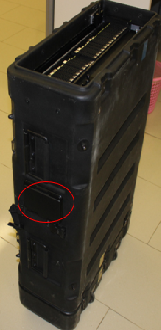

# Teleport开箱

## 开箱前检查

收到华为数据中心邮寄的Teleport设备后，现场检查Teleport设备箱外观是否完整，确保纽扣锁、拉手、滑轮正常可用，确认箱体外壳上粘贴的《开箱指导》是否完整清晰。如有损坏，请将设备退回至华为数据中心。确保设备无误后，再签收。

## 前提条件

-   已经通过短信获取开箱的帐号和密码。
-   已经签收Teleport设备箱。

## 开箱步骤

1.  将Teleport设备箱侧放在地面，触摸屏朝上，不影响物理锁扣解锁，方便打开箱子侧面的屏幕保护盖。如[图1](#zh-cn_topic_0097288780_fig814844317552)所示。

    **图 1**  Teleport设备箱屏幕保护盖  
    

2.  触摸屏幕，屏幕亮。

    > **说明：**   
    >如果遇到触摸屏不亮的情况，请使用通用USB接口对其充电数分钟后再使用。  

3.  单击“开箱”\>“密码输入”，输入帐号“user”，单击“完成”，输入密码（短信通知，工单后6位），单击“开箱”。听见“吱”的声响，盖子解锁成功。

    > **说明：**   
    >帐号“user”对应的密码会以短信的方式提前提供给用户，user帐号的密码默认是工单号后6位。  

4.  打开箱体两端共16个锁扣，取下两端的盖子，完成Teleport开箱。

