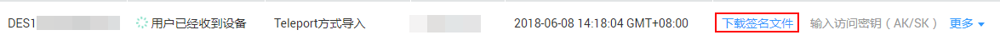

# 下载并导入签名文件

## 前提条件

-   已经完成Teleport方式服务单的申请。
-   已经完成Teleport连线及业务和逻辑IP地址配置。

## 操作步骤

1.  登录DES管理控制台。
2.  单击服务单列表本次订单最后一列“操作”\>“下载签名文件”。如[图1](#zh-cn_topic_0097289124_fig864813282819)所示。

    **图 1**  下载签名文件  
    

3.  将下载到本地的签名文件导入共享文件系统的根目录。

