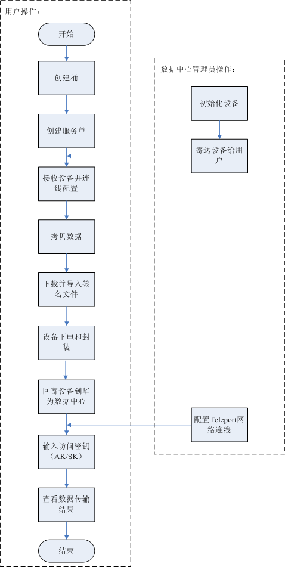

# 使用流程

Teleport方式数据快递服务使用流程如[图1](#fig19847027133410)和[表1](#tab01)。

**图 1**  Teleport方式使用流程图  

**表 1**  使用流程简介

<table><thead align="left"><tr id="row55845053"><th class="cellrowborder" valign="top" width="23.34%" id="mcps1.2.3.1.1">
操作步骤

</th>
<th class="cellrowborder" valign="top" width="76.66%" id="mcps1.2.3.1.2">
说明

</th>
</tr>
</thead>
<tbody><tr id="row166683414297"><td class="cellrowborder" valign="top" width="23.34%" headers="mcps1.2.3.1.1 ">
登录DES管理控制台

</td>
<td class="cellrowborder" valign="top" width="76.66%" headers="mcps1.2.3.1.2 ">
注册华为云，并开通数据快递服务。

</td>
</tr>
<tr id="row1295415177240"><td class="cellrowborder" valign="top" width="23.34%" headers="mcps1.2.3.1.1 ">
创建桶

</td>
<td class="cellrowborder" valign="top" width="76.66%" headers="mcps1.2.3.1.2 ">
数据快递服务的数据最终存放在OBS中，需先在OBS创建桶。

</td>
</tr>
<tr id="row59721402"><td class="cellrowborder" valign="top" width="23.34%" headers="mcps1.2.3.1.1 ">
创建服务单

</td>
<td class="cellrowborder" valign="top" width="76.66%" headers="mcps1.2.3.1.2 ">
就近选择华为数据中心，选择创建Teleport方式服务单。

</td>
</tr>
<tr id="row52483186"><td class="cellrowborder" valign="top" width="23.34%" headers="mcps1.2.3.1.1 ">
接收设备并连线配置

</td>
<td class="cellrowborder" valign="top" width="76.66%" headers="mcps1.2.3.1.2 ">
用户收到华为数据中心Teleport设备后开箱配置。

</td>
</tr>
<tr id="row64345914310"><td class="cellrowborder" valign="top" width="23.34%" headers="mcps1.2.3.1.1 ">
拷贝数据

</td>
<td class="cellrowborder" valign="top" width="76.66%" headers="mcps1.2.3.1.2 ">
用户将本地数据拷贝至Teleport存储系统。

</td>
</tr>
<tr id="row65337958"><td class="cellrowborder" valign="top" width="23.34%" headers="mcps1.2.3.1.1 ">
下载并导入签名文件

</td>
<td class="cellrowborder" valign="top" width="76.66%" headers="mcps1.2.3.1.2 ">
签名文件是服务单中Teleport设备的唯一标识，Teleport设备回寄前需要将签名文件存入teleportshare根目录。

</td>
</tr>
<tr id="row9488102014167"><td class="cellrowborder" valign="top" width="23.34%" headers="mcps1.2.3.1.1 ">
设备下电和封装

</td>
<td class="cellrowborder" valign="top" width="76.66%" headers="mcps1.2.3.1.2 ">
用户确保本地数据已全部存入Teleport后，将Teleport下电并封装。

</td>
</tr>
<tr id="row52539597"><td class="cellrowborder" valign="top" width="23.34%" headers="mcps1.2.3.1.1 ">
回寄设备

</td>
<td class="cellrowborder" valign="top" width="76.66%" headers="mcps1.2.3.1.2 ">
将Teleport回寄给华为数据中心，被回寄的Teleport存储系统中需要包含签名文件。

</td>
</tr>
<tr id="row35006119"><td class="cellrowborder" valign="top" width="23.34%" headers="mcps1.2.3.1.1 ">
启动数据上传

</td>
<td class="cellrowborder" valign="top" width="76.66%" headers="mcps1.2.3.1.2 ">
管理员将Teleport挂载到服务器，并且用户输入了AK/SK后，会启动数据上传。

</td>
</tr>
<tr id="row56251627"><td class="cellrowborder" valign="top" width="23.34%" headers="mcps1.2.3.1.1 ">
查看数据传输结果

</td>
<td class="cellrowborder" valign="top" width="76.66%" headers="mcps1.2.3.1.2 ">
完成数据传输后，用户可下载数据传输报告，检查数据是否全部上传成功。

</td>
</tr>
</tbody>
</table>

