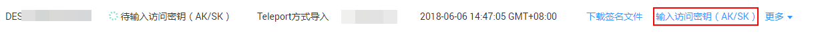
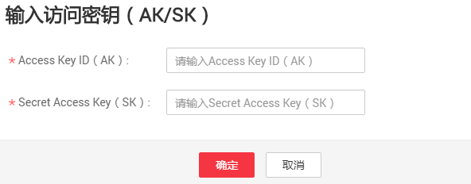

# 启动数据上传

## 前提条件

-   已经完成Teleport方式服务单的申请。
-   已经将Teleport寄送至华为数据中心。
-   已经收到来自华为数据中心发送的“请用户输入访问密钥（AK/SK）”的短信通知。

## 操作步骤

1.  登录DES管理控制台。
2.  单击“待输入访问密钥（AK/SK）”服务单后的“输入访问密钥（AK/SK）”，如[图1](#zh-cn_topic_0097288934_fig1720610110117)所示。

    **图 1**  输入访问密钥（Teleport方式）  
    

3.  根据界面提示，将后台往OBS的桶中上传数据时需要使用的密钥对（AK/SK）信息，填写到弹出的对话框中。如[图2](#zh-cn_topic_0097288934_fig4199122815117)所示。

    **图 2**  填写访问密钥（Teleport方式）  
    

    需要填写的数据如下：

    -   Access Key ID（AK）：后台往OBS的桶中上传数据时需要使用的接入证书。
    -   Secret Access Key（SK）：后台往OBS的桶中上传数据时需要使用的安全证书。

        > **说明：**   
        >若没有访问密钥（AK/SK），请通过单击右上角用户名，并在下拉列表中单击“[我的凭证](https://console.huaweicloud.com/iam/#/myCredential)”，进入“我的凭证”页面单击“管理访问密钥”页签下方的“新增访问密钥”，创建密钥。  

4.  单击“确定”，提交AK/SK。

    AK/SK提交成功且后台验证AK/SK数据无误后，数据便开始传输。

