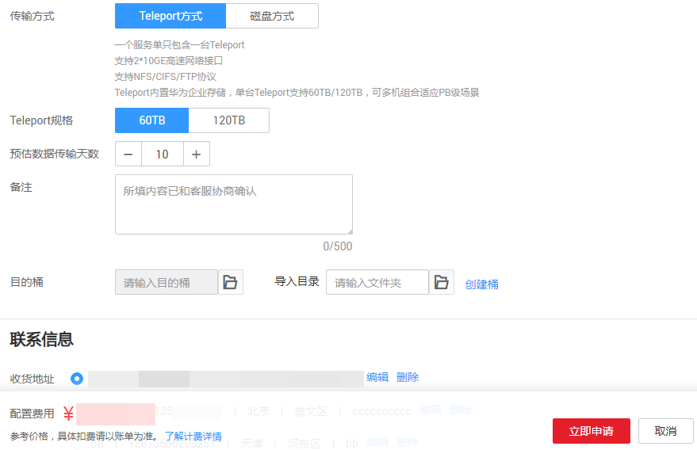
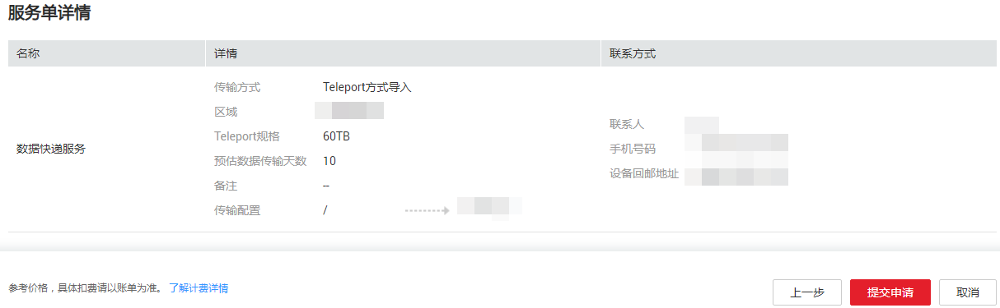

# 修改服务单

DES支持用户修改服务单。

## 背景信息

DES支持用户在以下三种服务单状态下修改服务单。

-   Teleport方式的服务单状态显示“服务单审核中”，此时，若用户发现服务单信息填写有误，可对服务单信息进行修改。
-   磁盘方式服务单状态显示“待寄送磁盘”，此时，若用户发现服务单信息填写有误，可对服务单信息进行修改。
-   磁盘方式状态显示“传输失败状态”，若传输失败的原因是用户填写的磁盘目录下的文件夹名称有误，界面会报“磁盘目录不存在”的错误，这种情况下，用户可修改磁盘目录下填写的文件夹名称后，重新填写访问密钥（AK/SK）启动数据上传。

## 操作步骤

Teleport方式和磁盘方式服务单修改方法相同。下面以修改“Teleport方式”服务单为例进行说明。

1.  登录DES管理控制台。
2.  单击待修改服务单后的“操作”\>“更多”\>“修改服务单”。如[图1](#fig292132411214)所示。

    **图 1**  修改服务单  
    

3.  根据实际需要修改的信息，修改服务单。如[图2](#fig57601835141218)所示。

    **图 2**  填写修改信息  
    

4.  单击“立即申请”，进入服务单详情界面。如[图3](#fig1956384611211)所示。

    **图 3**  服务单详情  
    

5.  单击“提交申请”，提交服务单。

    > **说明：**   
    >修改磁盘方式的服务单需要注意以下事项。  
    >-   若被修改的服务单状态为“待寄送磁盘”，修改后的服务单根据正常服务单处理流程继续执行即可。  
    >-   若被修改服务单状态为“传输失败”，修改后的服务单提交成功后，可单击“查看服务单详情”返回DES主页面查看服务单，此时修改后的服务单状态仍然为“传输失败”，单击该服务单后的“输入访问密钥（AK/SK）”，填写AK、SK及磁盘解密密码重新启动数据上传。AK、SK及磁盘解密密码校验无误后，服务单状态会由“传输失败”变成“正在传输数据”。  

