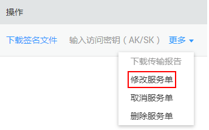

# 修改服务单

DES支持用户修改服务单。

## 背景信息

支持用户在以下三种服务单状态下修改服务单。

-   Teleport方式服务单状态显示“服务单审核中”，此时若用户发现服务单信息有误，可对服务单信息进行修改。
-   磁盘方式服务单状态显示“待寄送磁盘”，此时若用户发现服务单信息有误，可对服务单信息进行修改。
-   磁盘方式服务单状态显示“传输失败状态”，若因磁盘目录下的文件夹名称与服务单“磁盘文件”信息不一致，导致数据传输失败，界面提示“磁盘目录不存在”错误。这种情况下，用户可修改服务单“磁盘文件”信息，再重新输入访问密钥（AK/SK）启动数据上传。

## 操作步骤

Teleport方式和磁盘方式服务单修改方法相同。下面以修改“Teleport方式”服务单为例进行说明。

1.  登录DES管理控制台。
2.  单击待修改服务单“操作 \> 更多 \> 修改服务单”。如[图1](#fig292132411214)。

    **图 1**  修改服务单  
    

3.  进入服务单修改界面（同服务单创建界面），根据实际情况修改服务单信息。
4.  单击“立即申请”，确认服务单详情信息。
5.  单击“提交申请”，提交服务单。

    > **说明：**   
    >磁盘方式服务单的修改需注意以下事项。  
    >-   若被修改的服务单状态为“待寄送磁盘”，修改后的服务单根据正常服务单处理流程继续执行。  
    >-   若被修改服务单状态为“传输失败”，修改后的服务单提交成功后，服务单状态仍然为“传输失败”。此时需单击“输入访问密钥（AK/SK）”，重新输入AK/SK和磁盘解密密码，校验无误启动数据上传后，服务单状态才会由“传输失败”变成“正在传输数据”。  

