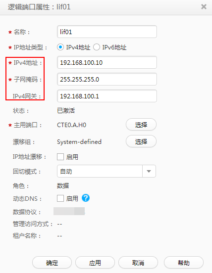

# 修改逻辑IP地址

Teleport设备通过逻辑端口访问共享文件系统，逻辑端口作为区分不同服务的端口，只有当Teleport设备逻辑IP与用户的业务IP地址属于同一网段时，才能使Teleport存储系统与用户业务网段相连通。

用户在使用Teleport存储系统前，需修改逻辑IP地址，使之与用户业务IP地址属于同一网段，且修改后的逻辑IP不能与管理IP同网段，否则会修改失败。本小节主要介绍如何修改逻辑端口属性。

## 前提条件

-   已经登录到DeviceManager界面。
-   通过短信已经获取DeviceManager界面登录的用户名和密码。

## 操作步骤

1.  在浏览器中输入“http://IP地址:8088”（默认IP地址192.168.128.101），登录Teleport设备的DeviceManager界面。其中“IP地址”为DeviceManager设备的管理IP地址。
2.  选择“资源分配 \> 端口 \> 逻辑端口”。选中系统自带的逻辑端口，单击“属性”，系统弹出“逻辑端口属性”对话框。如[图1](#fig206191037326)。

    IP地址、子网掩码和网关需要修改成和用户业务网络同一网段，以便用户客户端可以通过这个逻辑IP访问Teleport设备中的共享文件系统。其余参数保持默认值，无需修改。单击“确定”。

    系统弹出高危提示对话框，勾选“我已阅读上述信息，了解执行此操作带来的后果。”单击“确定”。

    **图 1**  修改逻辑端口IP地址  
    

3.  系统弹出“成功”对话框，提示操作成功。单击“确定”。

    > **注意：**   
    >在客户端访问NFS/CIFS共享时，必须使用逻辑端口地址来访问共享文件系统。  

