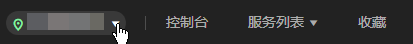
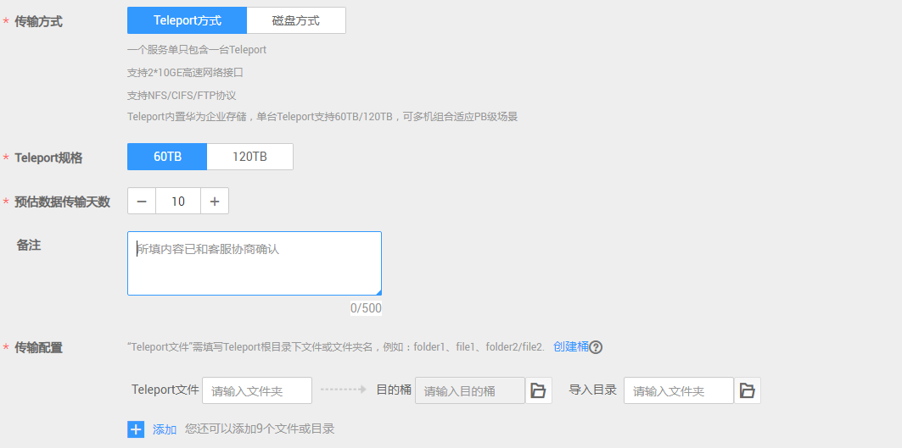
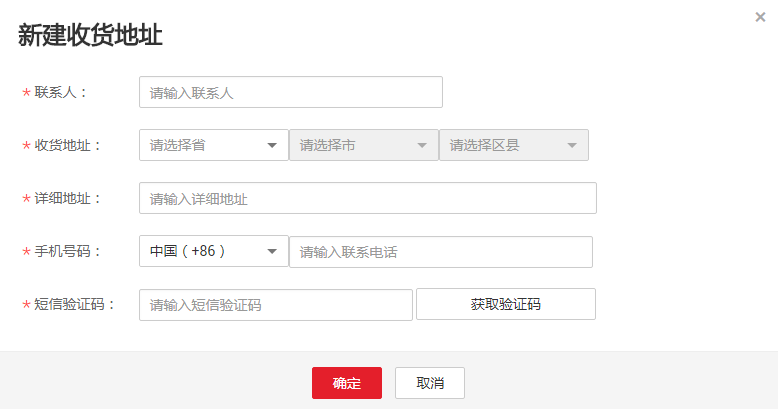
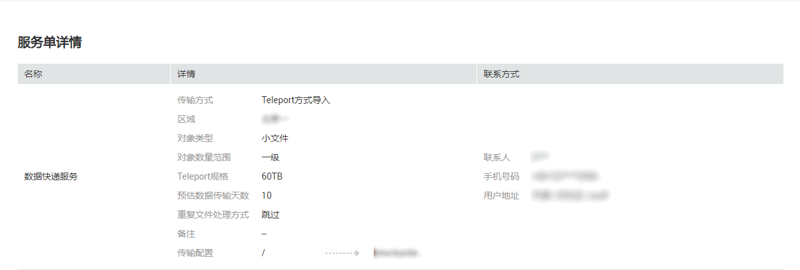

# 创建Teleport方式服务单

## 背景信息

用户需传输的数据量大，有几百TB数据待传输时，可选择创建Teleport方式服务单。在用户成功提交服务单后，华为数据中心会邮寄Teleport设备给用户，实现用户本地数据传输上云。

## 操作步骤

1.  登录管理控制台。
2.  单击“服务列表 \> 存储 \> 数据快递服务 DES”，进入DES管理控制台。
3.  根据规划，切换数据中心。用户可就近选择数据中心，如[图1](#fig7347191312457)。

    **图 1**  Teleport方式切换数据中心  
    

4.  单击“购买数据快递服务”，进入服务单创建页面。
5.  输入“传输信息”。传输方式选择“Teleport方式”，根据实际情况设置带“\*”的必填项，如[图2](#fig13420137533)。

    **图 2**  输入Teleport方式传输信息  
    

    -   “Teleport规格”：Teleport单设备支持60TB和120TB两种规格，若数据量超过120TB，可申请多个Teleport方式服务单，多机组合使用。
    -   “对象类型”：用户根据待传输数据文件大小类型，分别选择“小文件”、“普通文件”和“超大文件”。
    -   “对象数量范围”：用户预估的待传输数据文件数量范围，文件数量分为四个等级，从一级到四级，选择的级别越大表明待传输数据文件数量越多。
    -   “预估数据传输天数”：用户预估数据从本地数据中心拷贝到Teleport的时长（即Teleport在用户数据中心停留的时长）。停留超过10天，每天将收取200元的超期费用。该参数仅用于价格预估，实际价格以实际时长为准。
    -   “重复文件处理方式”：对上传到同一目的桶中重复文件的处理方式。选择“跳过”表示不作修改，保留原有文件；选择“覆盖”表示用正在传输的文件替换原有文件。
    -   （可选）“源数据”：用户根据数据目录，输入将拷贝到Teleport根目录下的文件或文件夹名称。若输入文件或文件夹名称，表示将该文件数据或文件夹中的所有数据传输到指定的目的桶中；若不输入，则默认将Teleport中所有文件传输到目的桶。

        一个输入框中只能输入一个文件或文件夹名称，若需要传输多个文件或文件夹，可单击“添加”，输入多个不同的“源数据”目录名称。例如：用户待上传数据目录下包含“file01”和“file02”两个文件夹，用户可将这两个文件夹分别输入到不同的“源数据”的输入框中，且可以选择不同的“目的桶”，后续将两个文件夹拷贝到Teleport设备传输，实现数据分类。

        > **说明：** 
        >文件夹名称不能包括以下字符：\\/:\*?"<\>|，不能以.开头。

    -   “目的桶”：单击目的桶后面的“文件夹”图标，选择Teleport数据传输的目的桶。若目的桶不存在，可单击“创建桶”创建可用的桶后，再刷新目的桶并重试；也可以登录[控制台](https://console.huaweicloud.com)，选择对象存储服务，创建可用的桶后，再刷新目的桶并重试。
    -   （可选）“导入目录”：单击导入目录后面“文件夹”图标，选择数据即将导入到桶中的具体目录。用户可自定义目录名称，后台会把数据保存在该目录中；若不选择，则默认将数据直接导入目的桶。

        > **说明：** 
        >最多只能创建10个“磁盘文件”或“导入目录”。

6.  选择收货地址。首次创建服务单需要新建收货地址，用于华为数据中心邮寄Teleport给用户，必填信息如[图3](#fig172413361874)。

    **图 3**  Teleport方式新建收货地址  
    

    -   “联系人”：输入联系人姓名。
    -   “收货地址”：输入联系人所在的省、市、区地址。
    -   “详细地址”：输入详细的小区或者街道地址以及门牌号等信息。
    -   “手机号码”：输入联系人手机号码。
    -   “验证码”：单击获取验证码。

        > **说明：** 
        >最多只能创建5条用户收货地址。

7.  服务单信息确认。单击“立即购买”，确认运输提示信息后，查看服务单详细信息，如[图4](#fig73442118259)。

    **图 4**  Teleport方式服务单详情  
    

    > **说明：** 
    >请仔细确认服务单信息，如果信息有误，可单击“上一步”进行修改。

8.  单击“立即购买”，提交服务单。服务单创建成功，进入如[图5](#fig24931621843)页面。

    **图 5**  Teleport方式服务单提交成功  
    

    > **须知：** 
    >此处单击“下载签名文件”可下载签名文件保存到本地，也可以在DES管理控制台服务单列表处下载。

> **说明：** 
>一个服务单仅需上传一次访问密钥（AK/SK）。服务单创建完成后，即可在服务单列表中的操作列单击“输入访问密钥（AK/SK）”上传AK/SK。获取最新访问密钥，请参考[访问密钥（AK/SK）管理](https://support.huaweicloud.com/usermanual-ca/ca_01_0003.html)。

