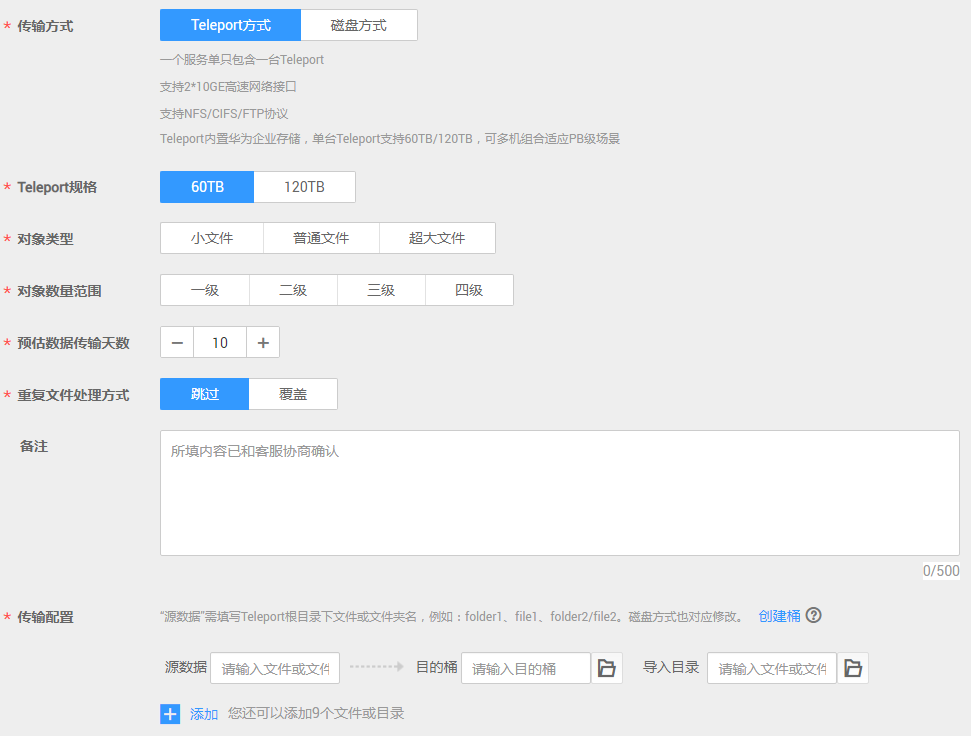

# 创建Teleport方式服务单

## 背景信息

用户需传输的数据量大，有几百TB或PB级数据待传输时，可选择创建Teleport方式服务单，来使用DES。在用户成功提交服务单后，华为数据中心会邮寄Teleport设备给用户，来实现用户本地数据传输上云。

## 操作步骤

1.  登录DES管理控制台。
2.  根据规划，切换数据中心，用户可就近选择数据中心。如[图1](#fig7347191312457)。

    **图 1**  Teleport方式切换数据中心  
    

3.  单击“服务列表 \> 存储 \> 数据快递服务”，进入数据快递服务管理控制台。
4.  单击“申请数据快递服务”，进入数据快递服务服务单创建界面。
5.  输入“传输信息”。选择“Teleport方式”传输方式，根据实际情况输入必填项“Teleport规格”“预估数据传输天数”和“传输配置”，如[图2](#fig13420137533)。

    **图 2**  输入Teleport方式传输信息  
    

    -   “Teleport规格”：Teleport单设备支持60TB和120TB两种规格，若数据量超过120T，可申请多个Teleport方式服务单，多机组合使用。
    -   “Telepore文件”：用户根据数据目录，输入将拷贝到Teleport根目录下的文件或文件夹名称。若输入文件或文件夹名称，表示将该文件数据或文件夹中的所有数据传输到指定的目的桶中；若不输入，则默认将Teleport中所有文件传输到目的桶。

        一个输入框中只能输入一个文件或文件夹名称，若需要传输多个文件或文件夹，可单击“添加”，输入多个不同的“Teleport文件”目录名称。例如：用户待上传数据目录下包含“file01”和“file02”两个文件夹，用户可将这两个文件夹分别输入到不同的“Teleport文件”的输入框中，且可以选择不同的“目的桶”，后续将两个文件夹拷贝到Teleport设备传输，实现数据分类。

        > **说明：**   
        >文件夹名称不能包括以下字符：\\/:\*?"<\>|，不能以.开头。  

    -   “目的桶”：单击目的桶后面的“文件夹”图标，选择Teleport数据传输的目的桶。若目的桶不存在，可单击“创建桶”创建可用的桶后，再刷新目的桶并重试；也可以登录[控制台](https://console.huaweicloud.com)，选择对象存储服务，创建可用的桶后，再刷新目的桶并重试。
    -   “导入目录”：单击导入目录后面“文件夹”图标，选择数据即将导入到桶中的具体目录。您也可以手工输入目录名称，后台会把会把数据保存在该目录中。

        > **说明：**   
        >“导入目录”为可选项，如果不选择，则表示用户数据直接导入目的桶中。  

6.  选择收货地址。首次创建服务单需要新建收货地址，用于华为数据中心邮寄Teleport给用户，需输入内容如[图3](#fig172413361874)。

    **图 3**  Teleport方式新建收货地址  
    

    -   “联系人”：输入联系人姓名。
    -   “收货地址”：输入联系人所在的省、市、区地址。
    -   “详细地址”：输入详细的小区或者街道地址以及门牌号等信息。
    -   “手机号码”：输入联系人手机号码。
    -   “短信验证码”：单击获取验证码。

        > **说明：**   
        >最多只能创建5条用户收货地址。  

7.  服务单信息确认。单击“立即申请”，提示信息单击“确认”，进入服务单详情确认界面，如[图4](#fig73442118259)。

    **图 4**  Teleport方式服务单详情  
    

    > **说明：**   
    >请仔细查看服务单详情，如果信息有误，单击“上一步”进行修改。  

8.  单击“提交申请”，提交服务单。

    服务单创建成功后，进入如[图5](#fig24931621843)界面。

    **图 5**  Teleport方式服务单提交成功  
    

    > **注意：**   
    >此处单击“下载签名文件”可下载签名文件保存到本地，也可以在DES管理控制台服务单列表处下载。  

> **说明：**   
>服务单创建完成后，即可上传AK/SK，一个服务单仅需上传一次AK/SK。  

