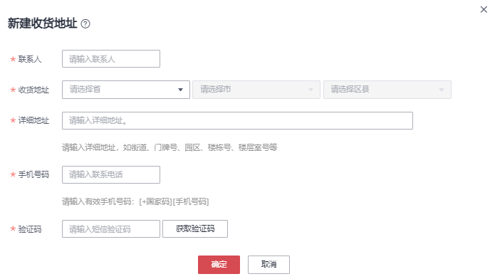

# 创建Teleport方式服务单

## 背景信息

用户需迁移数据量大，有几百TB或PB级数据待迁移时，可选择创建Teleport方式服务单，来使用DES。在用户成功提交服务单之后，华为数据中心会邮寄Teleport存储设备给用户。

## 操作步骤

1.  登录DES管理控制台。
2.  根据规划，切换数据中心，用户可就近选择。如[图1](#fig75102056829)所示。

    **图 1**  Teleport方式切换数据中心  
    

3.  单击“服务列表”\>“存储”\>“数据快递服务”，进入数据快递服务管理控制台。
4.  单击“申请数据快递服务”。
5.  选择“Teleport方式”传输方式。
6.  填写“传输信息”。如[图2](#fig13420137533)所示。

    **图 2**  填写Teleport方式传输信息  
    

    -   “Telepore文件”：用户根据待传输数据目录，填写将拷贝到Teleport根目录下的文件或文件夹名称。若填写文件或文件夹名称，表示将该文件数据或文件夹中的所有数据传输到指定的目的桶中；若不填写，则默认将磁盘中所有文件传输到目的桶。

        一个输入框中只能填写一个文件或文件夹名称，若需要传输多个文件或文件夹，可单击“添加”，填写多个不同的“Teleport文件”目录名称。例如：用户待上传数据目录下包含“file01”和“file02”两个文件夹，用户可将这两个文件夹分别填写到不同的“Teleport文件”的输入框中，且可以选择不同的“目的桶”，后续将两个文件夹拷贝到Teleport设备传输，实现数据分类。

        > **说明：**   
        >文件夹名称不能包括以下字符：\\/:\*?"<\>|，不能以.开头。  

    -   “目的桶”：单击目的桶后面的“文件夹”图标，选择Teleport数据传输的目的桶。若目的桶不存在，可单击“创建桶”创建可用的桶后，再刷新目的桶并重试；也可以登录[控制台](https://console.huaweicloud.com)，选择对象存储服务，创建可用的桶后，再刷新目的桶并重试。
    -   “导入目录”：单击导入目录后面“文件夹”图标，选择数据即将导入到桶中的具体目录。您也可以手工输入目录名称，后台会把会把数据保存在该目录中。

        > **说明：**   
        >“导入目录”为可选项，如果不选择，则表示用户数据直接导入目的桶中。  

7.  新建收货地址，首次创建服务单需要填写用户收货地址，用于华为数据中心寄出Teleport。如[图3](#fig172413361874)所示。

    **图 3**  Teleport方式新建收货地址  
    

    -   “联系人”：填写联系人姓名。
    -   “收货地址”：填写联系人所在的省、市、区地址。
    -   “详细地址”：填写详细的小区或者街道地址以及门牌号等信息。
    -   “手机号码”：填写联系人手机号码。
    -   “短信验证码”：点击获取验证码。

        > **说明：**   
        >收货地址最多只能创建5条。  

8.  单击“立即申请”，提示信息单击“确认”，进入服务单详情界面。如[图4](#fig73442118259)所示。

    **图 4**  Teleport方式服务单详情  
    

    > **说明：**   
    >请仔细查看服务单详情，如果信息有误，单击“上一步”进行修改。  

9.  单击“提交申请”，提交服务单。

    服务单创建成功后，进入如[图5](#fig24931621843)所示界面。

    **图 5**  Teleport方式服务单提交成功  
    

    > **注意：**   
    >可以在此处“下载签名文件”，也可以在服务单列表后面单击“下载签名文件”。  

> **说明：**   
>服务订单创建完成后，即可上传AK/SK密钥，一个服务订单仅需上传一次AK/SK密钥。  
