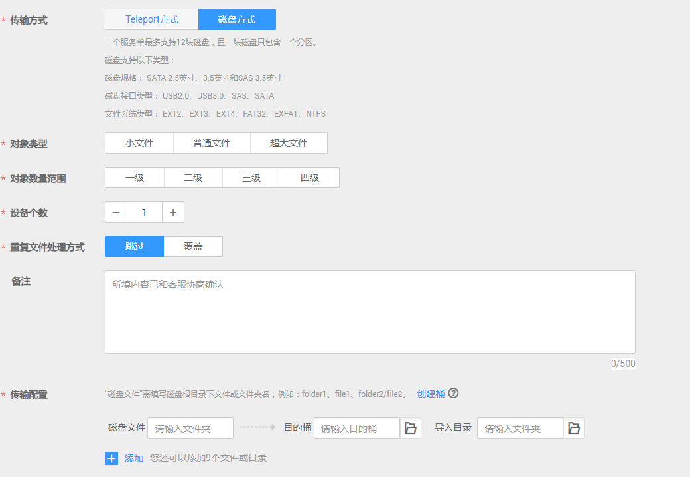
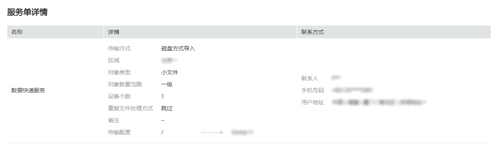

# 创建磁盘方式服务单

## 背景信息

用户数据已存储在自己的磁盘中，并能邮寄自己的磁盘到华为数据中心，可选择创建磁盘方式服务单。华为数据中心支持用户磁盘类型参见[表1](#d0e2003)。

> **说明：** 
>一个服务单最多支持12块磁盘，且一块磁盘只包含一个分区。

**表 1**  磁盘兼容性

<table><thead align="left"><tr id="row59531373"><th class="cellrowborder" valign="top" width="33.29%" id="mcps1.2.3.1.1">
兼容性

</th>
<th class="cellrowborder" valign="top" width="66.71000000000001%" id="mcps1.2.3.1.2">
支持规格

</th>
</tr>
</thead>
<tbody><tr id="row12573920"><td class="cellrowborder" valign="top" width="33.29%" headers="mcps1.2.3.1.1 ">
磁盘规格

</td>
<td class="cellrowborder" valign="top" width="66.71000000000001%" headers="mcps1.2.3.1.2 ">
SATA 2.5英寸、SATA 3.5英寸、SAS 3.5英寸。

</td>
</tr>
<tr id="row52078514"><td class="cellrowborder" valign="top" width="33.29%" headers="mcps1.2.3.1.1 ">
磁盘接口

</td>
<td class="cellrowborder" valign="top" width="66.71000000000001%" headers="mcps1.2.3.1.2 ">
USB2.0、USB3.0、SAS、SATA。

</td>
</tr>
<tr id="row54712068"><td class="cellrowborder" valign="top" width="33.29%" headers="mcps1.2.3.1.1 ">
磁盘文件系统

</td>
<td class="cellrowborder" valign="top" width="66.71000000000001%" headers="mcps1.2.3.1.2 ">
EXT2、EXT3、EXT4、FAT32、EXFAT、NTFS。

</td>
</tr>
</tbody>
</table>

## 操作步骤

1.  登录管理控制台。
2.  单击“服务列表 \> 存储 \> 数据快递服务 DES”，进入DES管理控制台。
3.  根据规划，切换数据中心。用户可就近选择数据中心，如[图1](#fig75102056829)。

    **图 1**  磁盘方式切换数据中心  
    

4.  单击“购买数据快递服务”，进入服务单创建页面。
5.  输入“传输信息”。选择“磁盘方式”传输方式，根据实际情况设置带“\*”的必填项，如[图2](#fig109565610320)。

    **图 2**  输入磁盘方式传输信息  
    

    -   “对象类型”：用户根据待传输数据文件类型，分别选择“小文件”、“普通文件”和“超大文件”。
    -   “对象数量范围”：用户预估的待传输数据文件数量范围，文件数量分为四个等级，从一级到四级，选择的级别越大表明待传输数据文件数量越多。
    -   “设备个数”：用户存储待传输数据的磁盘个数。一个磁盘方式服务单最多可设置12块磁盘。
    -   “重复文件处理方式”：设置对同一目录下重复文件的处理方式。选择“跳过”表示不作修改，保留原有文件；选择“覆盖”表示用正在传输的文件替换原有文件。
    -   （可选）“磁盘文件”：输入用户磁盘根目录下文件或文件夹名称。若输入文件或文件夹名称，表示将该文件数据或文件夹中的所有数据传输到指定的目的桶中；若不输入，则默认将磁盘中所有文件传输到目的桶。

        一个输入框中只能输入一个文件或文件夹名称，若需要传输多个文件或文件夹，可单击“添加”，输入多个不同的磁盘目录。例如：用户磁盘中的根目录下包含“test01”和“test02”两个文件夹，用户可将这两个文件夹分别输入到不同的“磁盘文件”的输入框中，且可以选择不同的“目的桶”，实现数据分类。

        > **说明：** 
        >文件夹名称不能包括以下字符：\\/:\*?"<\>|，不能以.开头。

    -   “目的桶”：单击目的桶后面的“文件夹”图标，选择磁盘数据传输的目的桶。若目的桶不存在，可单击“创建桶”，创建可用的桶后，再刷新目的桶并重试；也可以登录[控制台](https://console.huaweicloud.com)，选择对象存储服务，创建可用的桶后，再刷新目的桶并重试。
    -   （可选）“导入目录”：单击导入目录后面“文件夹”图标，选择数据即将导入到桶中的具体目录。用户可自定义目录名称，后台会把数据保存在该目录中；若不选择，则默认将数据直接导入目的桶。

        > **说明：** 
        >最多只能创建10个“磁盘文件”或“导入目录”。

6.  选择收货地址。首次创建服务单需要新建收货地址，用于华为数据中心回寄磁盘给用户，需输入内容如[图3](#fig19986201415315)。

    **图 3**  磁盘方式新建收货地址  
    

    -   “联系人”：输入联系人姓名。
    -   “收货地址”：输入联系人所在的省、市、区地址。
    -   “详细地址”：输入详细的小区或者街道地址以及门牌号等信息。
    -   “手机号码”：输入联系人手机号码。
    -   “短信验证码”：单击获取验证码。

        > **说明：** 
        >最多只能创建5条收货地址。

7.  服务单信息确认。单击“立即购买”，确认运输提示信息后，查看服务单详细信息，如[图4](#fig351619241933)。

    **图 4**  磁盘方式服务单详情  
    

    > **说明：** 
    >请仔细查看服务单信息，如果信息有误，单击“上一步”进行修改。

8.  单击“立即购买”，提交服务单，服务单创建成功，进入如[图5](#fig24931621843)页面。

    **图 5**  磁盘方式提交服务单成功  
    

    > **须知：** 
    >此处单击“下载签名文件”可下载签名文件保存到本地，也可以在DES管理控制台服务单列表处下载。

> **说明：** 
>一个服务单仅需上传一次访问密钥（AK/SK）。服务单创建完成后，即可在服务单列表中的操作列单击“输入访问密钥（AK/SK）”上传AK/SK。获取最新访问密钥，请参考[访问密钥（AK/SK）管理](https://support.huaweicloud.com/usermanual-ca/ca_01_0003.html)。

