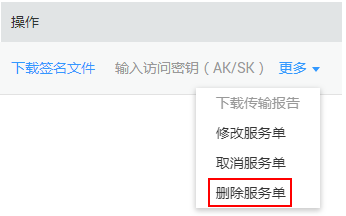

# 删除服务单

用户可以删除已创建的数据快递服务单。

## 前提条件

-   Teleport方式的服务单状态为“服务单审核中”或“已取消”，此时可删除服务单。
-   磁盘方式的服务单状态为“待寄送磁盘”、“已取消”、“已过期”时可删除服务单。

## 操作步骤

1.  登录DES管理控制台。
2.  单击待删除服务单后的“操作”\>“更多 ”\>“ 删除服务单”，如[图1](#fig11639154011578)所示，可以删除数据快递服务单。

    **图 1**  删除服务单  
    

