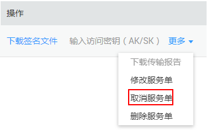

# 取消服务单

DES支持用户取消已创建的数据快递服务单。

## 前提条件

-   Teleport方式服务单已创建，状态显示“服务单审核中”，此时可取消服务单。
-   磁盘方式服务单已创建，但用户还未寄送磁盘到华为数据中心，即服务单状态为“待寄送磁盘”时可取消服务单。

## 操作步骤

1.  登录DES管理控制台。
2.  单击待取消服务单的“操作 \> 更多 \> 取消服务单”，如[图1](#fig552455641210)。

    **图 1**  取消服务单  
    

3.  进入取消服务单提示界面，单击“确认”取消数据快递服务单。
4.  服务单取消后，服务单状态会变为“已取消”。

