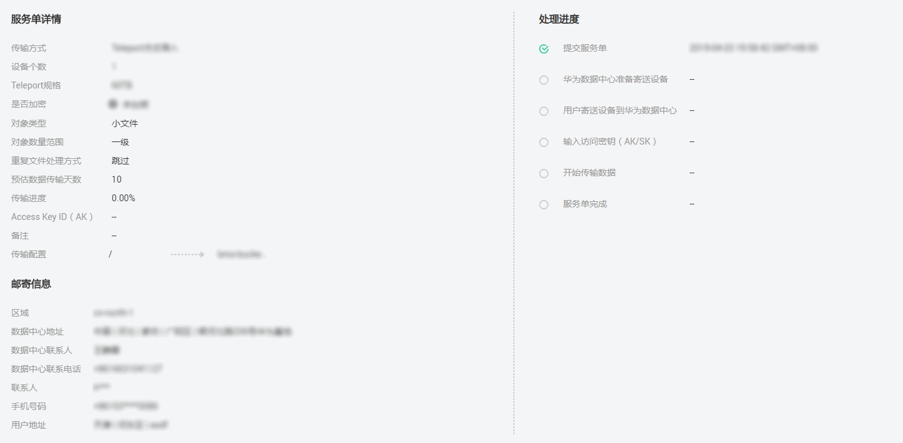

# 查看服务单详情

在使用数据快递服务过程中，用户可登录DES管理控制台随时查看服务单状态，跟踪数据传输动态。

## 前提条件

已成功申请DES服务单。

## 操作步骤

1.  登录DES管理控制台。
2.  单击服务单号前的下拉箭头，查看“服务单详情”、“邮寄信息”和“处理进度”。

    “服务单详情”包含传输配置详细信息、Access Key ID；“邮寄信息”包含数据中心详细联系信息、用户详细联系信息；“处理进度”包含提交服务单、开始传输数据、服务单完成等时间信息，如[图1](#fig2088181141218)。

    **图 1**  查看服务单详情  
    

