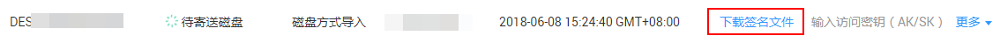

# 下载并导入签名文件

寄送磁盘之前需要将签名文件存入磁盘一起寄送。

## 前提条件

-   已创建DES服务单。
-   已完成数据拷贝。

## 操作步骤

1.  登录DES管理控制台。
2.  单击状态为“待寄送磁盘”的服务单后的“下载签名文件”，将签名文件下载到本地。如[图1](#fig1462144917811)所示。

    **图 1**  下载签名文件（磁盘方式）  
    

    签名文件是此服务单中磁盘的唯一标识，磁盘邮寄之前需要确保已经将签名文件存入磁盘根目录，并且未对签名文件进行加密。华为数据中心管理员收到磁盘后直接将其挂载到物理服务器上，系统会根据签名文件自动匹配存储设备与服务单，避免人工干预带来的误操作。

    签名文件中包含如[表1](#table_037B4FCF)所示内容：

    **表 1**  签名文件（磁盘方式）

    
    <table><thead align="left"><tr id="row11161650"><th class="cellrowborder" valign="top" width="31.31%" id="mcps1.2.3.1.1">
参数

    </th>
    <th class="cellrowborder" valign="top" width="68.69%" id="mcps1.2.3.1.2">
说明

    </th>
    </tr>
    </thead>
    <tbody><tr id="row842192851611"><td class="cellrowborder" valign="top" width="31.31%" headers="mcps1.2.3.1.1 ">
version

    </td>
    <td class="cellrowborder" valign="top" width="68.69%" headers="mcps1.2.3.1.2 ">
服务版本号。

    </td>
    </tr>
    <tr id="row6107499"><td class="cellrowborder" valign="top" width="31.31%" headers="mcps1.2.3.1.1 ">
OrderURN

    </td>
    <td class="cellrowborder" valign="top" width="68.69%" headers="mcps1.2.3.1.2 ">
包括了服务名称、创建服务单所在的区域、服务签名以及服务单号信息。

    </td>
    </tr>
    </tbody>
    </table>

    > **注意：**   
    >将下载到本地的签名文件拷贝到磁盘根目录，注意签名文件不能加密。  
    >为了避免对签名文件加密，建议先加密拷贝数据，然后再下载签名文件。  

