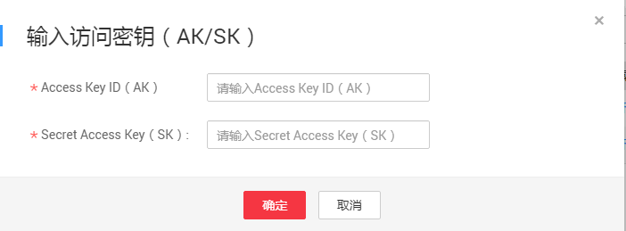

# 启动数据上传

数据中心管理员收到用户的磁盘并将磁盘挂载到物理服务器后，会短信通知用户填写访问密钥（AK/SK）来启动数据上传。

## 前提条件

用户收到短信通知输入访问密钥（AK/SK）。

## 操作步骤

1.  登录DES管理控制台。单击“待输入访问密钥（AK/SK）”服务单后的“操作”\>“输入访问密钥（AK/SK）”，如[图1](#fig15712522101)所示。

    **图 1**  输入访问密钥（磁盘方式）  
    

2.  根据界面提示，将后台往OBS的桶中上传数据时需要使用的密钥对（AK/SK）信息，填写到弹出的对话框中。如[图2](#fig4199122815117)所示。

    **图 2**  填写访问密钥（磁盘方式）  
    

    需要填写的数据如下：

    -   Access Key ID（AK）：后台往OBS的桶中上传数据时需要使用的接入证书。
    -   Secret Access Key（SK）：后台往OBS的桶中上传数据时需要使用的安全证书。
    -   （可选）数据是否加密：勾选表示用户磁盘数据被加密，需要填写“解密密码”，不勾选表示用户磁盘数据未加密，则不需要填写解密密码。
    -   （可选） 解密密码：用户加密磁盘数据时设置的密码。（若磁盘数据未加密，可不填；若磁盘被加密，但未填写磁盘解密密码，签名文件会被看成数据上传到目标桶中。）

        > **说明：**   
        >若没有访问密钥（AK/SK），请通过单击页面右上角用户名，并在下拉列表中单击“[我的凭证](https://console.huaweicloud.com/iam/#/myCredential)”，进入“我的凭证”页面单击“管理访问密钥”页签下方的“新增访问密钥”来创建。  

3.  单击“确定”，提交AK/SK。

    AK/SK提交成功且后台验证AK/SK无误后，数据便开始传输。

