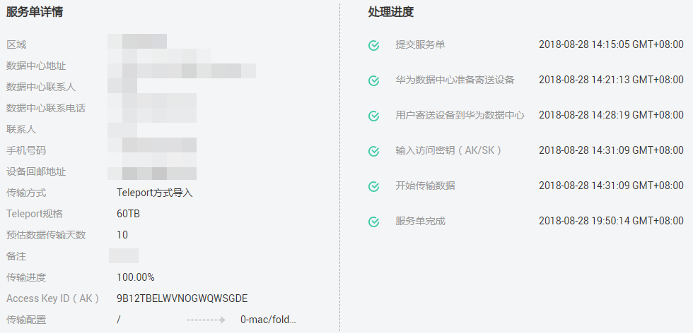

# 管理服务单

在使用数据快递服务过程中，用户可登录DES管理控制台随时查看服务单状态，跟踪数据传输动态。同时用户可修改、取消和删除已创建的服务单。

## 查看服务单详情

1.  登录DES管理控制台。
2.  单击服务单号前的下拉箭头，查看“服务单详情”、“邮寄信息”和“处理进度”。

    “服务单详情”包含传输配置详细信息、Access Key ID；“邮寄信息”包含数据中心详细联系信息、用户详细联系信息；“处理进度”包含提交服务单、开始传输数据、服务单完成等时间信息，如[图1](#fig2088181141218)。

    **图 1**  查看服务单详情  
    

## 修改服务单

仅支持在以下三种服务单状态下修改服务单：Teleport方式服务单状态为“服务单审核中”、磁盘方式服务单状态为“待寄送磁盘”、磁盘方式服务单状态为“传输失败”。

-   若被修改的服务单状态为“服务单审核中”或“待寄送磁盘”，修改后的服务单根据正常服务单处理流程继续执行。
-   若被修改服务单状态为“传输失败”，修改后的服务单提交成功后，服务单状态仍然为“传输失败”。此时需重新输入AK/SK，校验无误启动数据上传后，服务单状态才会由“传输失败”转换为“正在传输数据”。

1.  登录DES管理控制台。
2.  单击待修改服务单操作列的“更多 \> 修改服务单”。
3.  进入服务单修改界面（同服务单创建界面），分别按照Teleport方式和磁盘方式，根据实际情况修改服务单信息。
4.  单击“立即购买”，确认服务单详情信息，提交服务单。

## 取消服务单

-   Teleport方式服务单已创建，在状态显示“准备寄送设备”前可取消服务单，即在“服务单审核中”、“设备初始化中”和“准备寄送设备”三个状态下均可取消服务单。
-   磁盘方式服务单已创建，但用户还未寄送磁盘到华为数据中心，即服务单状态为“待寄送磁盘”时可取消服务单。

1.  登录DES管理控制台。
2.  单击待操作服务单操作列的“更多 \> 取消服务单”。
3.  进入取消服务单提示界面，单击“确认”，取消数据快递服务单。
4.  服务单取消后，服务单状态会变为“已取消”。

## 删除服务单

-   Teleport方式的服务单状态为“服务单审核中”或“已取消”时可删除服务单。
-   磁盘方式的服务单状态为“待寄送磁盘”、“已取消”、“已过期”时可删除服务单。

1.  登录DES管理控制台。
2.  在操作列单击“更多 \> 删除服务单”。

