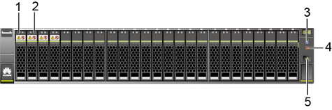

# 设备上电

连线完成后，Teleport设备需要上电检查运行状态。上电时只需按一下电源按钮。当控制框电源指示灯绿色闪烁，表示Teleport设备开始正常上电。系统正常上电后指示灯状态如[图1](#zh-cn_topic_0097288781_fig14976442115019)和[表1](#zh-cn_topic_0097288781_table1265302017511)。

> **须知：** 
>-   存储系统上电前，请确保所有线缆已经全部正确连接。上电后再调整线缆连接方式可能导致存储系统异常。
>-   对于配置两个控制器的存储系统，初次上电或清除系统配置后重新上电存储系统前，请确保控制器A连线正常并位于控制框中，否则会导致存储系统上电失败。
>-   上电过程中，请不要插拔光纤、网线、保险箱盘或接口模块，以免丢失系统数据。
>-   请勿长按电源按钮，长按超过5秒钟将导致存储系统下电。
>-   存储系统上电需要15\~30分钟。

**图 1**  Teleport设备指示灯（前视图）  

**表 1**  指示灯状态说明

<table><thead align="left"><tr id="zh-cn_topic_0097288781_row56548201754"><th class="cellrowborder" valign="top" width="19.67%" id="mcps1.2.3.1.1">
编号

</th>
<th class="cellrowborder" valign="top" width="80.33%" id="mcps1.2.3.1.2">
说明

</th>
</tr>
</thead>
<tbody><tr id="zh-cn_topic_0097288781_row1655220651"><td class="cellrowborder" valign="top" width="19.67%" headers="mcps1.2.3.1.1 ">
1

</td>
<td class="cellrowborder" valign="top" width="80.33%" headers="mcps1.2.3.1.2 ">
硬盘模块运行指示灯（绿色常亮）

</td>
</tr>
<tr id="zh-cn_topic_0097288781_row196558207515"><td class="cellrowborder" valign="top" width="19.67%" headers="mcps1.2.3.1.1 ">
2

</td>
<td class="cellrowborder" valign="top" width="80.33%" headers="mcps1.2.3.1.2 ">
硬盘模块定位/告警指示灯（熄灭）

</td>
</tr>
<tr id="zh-cn_topic_0097288781_row18655142015518"><td class="cellrowborder" valign="top" width="19.67%" headers="mcps1.2.3.1.1 ">
3

</td>
<td class="cellrowborder" valign="top" width="80.33%" headers="mcps1.2.3.1.2 ">
控制框定位指示灯（蓝色闪烁）

</td>
</tr>
<tr id="zh-cn_topic_0097288781_row116554201351"><td class="cellrowborder" valign="top" width="19.67%" headers="mcps1.2.3.1.1 ">
4

</td>
<td class="cellrowborder" valign="top" width="80.33%" headers="mcps1.2.3.1.2 ">
控制框告警指示灯（熄灭）

</td>
</tr>
<tr id="zh-cn_topic_0097288781_row465517201857"><td class="cellrowborder" valign="top" width="19.67%" headers="mcps1.2.3.1.1 ">
5

</td>
<td class="cellrowborder" valign="top" width="80.33%" headers="mcps1.2.3.1.2 ">
控制框电源指示灯/电源按钮（绿色常亮）

</td>
</tr>
</tbody>
</table>

