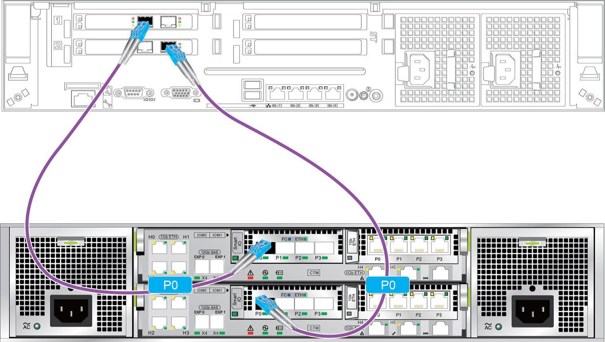

# 配置业务网络连线

通过网线将控制框GE/10GE电端口与应用服务器端口进行连接，现有普通网线和光纤作业务线，分别连接Teleport设备GE电端口和10GE电端口，完成与业务网络的连接，建立业务通道，实现Teleport设备与应用服务器之间的数据交换。

Teleport设备的GE电端口和10GE电端口连接，如[图1](#zh-cn_topic_0097288782_fig127234414311)和[图2](#zh-cn_topic_0097288782_fig59302313445)所示，用户根据实际情况，分别选用普通网线和光纤与用户应用服务器的直接连接。

**图 1**  GE电端口通过普通网线链接  

**图 2**  10GE电端口通过光纤连接  

> **说明：**   
>10GE电端口与GE电端口的连线方法相同，只是网卡硬件类型不同。  

