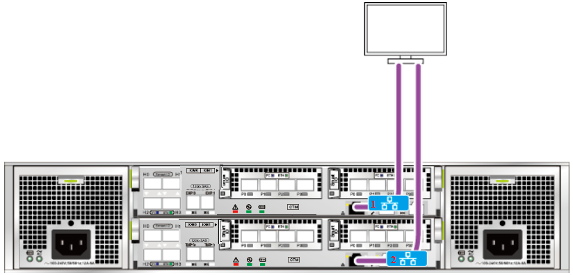

# 配置管理网络连线

完成Teleport设备开箱后，显现出内部2600V3存储设备的前侧电源按钮和指示灯，后侧控制框线缆接口。通过局域网将Teleport后侧的管理网口与维护终端网口连接，建立管理通道，实现维护终端对存储设备的管理和维护。

连接网线至管理网口，网口1为管理网口，一般只需连接管理网口来进行配置管理，如[图1](#zh-cn_topic_0101813136_fig14773549121313)所示。

**图 1**  连接网线至管理网口  

