# （可选）加密磁盘数据<a name="ZH-CN_TOPIC_0094556683"></a>

为了确保用户数据更加安全，磁盘方式服务单可以选择加密磁盘数据。

## TrueCrypt工具简介<a name="ades_user_guide_0031"></a>

“TrueCrypt”工具是一款免费开源的加密软件，同时支持Windows Vista、Windows7、WindowsXP、Mac OS X、Linux等操作系统。“TrueCrypt”不需要生成任何文件即可在硬盘上建立虚拟磁盘，用户可以按照盘符进行访问，所有虚拟磁盘上的文件都被自动加密，需要通过密码来进行访问。

## 背景信息<a name="gen-id1.7.6.10.7.4.2"></a>

为防止用户数据在线下邮寄的过程中，因意外情况导致数据泄漏（例如：磁盘被人盗取），建议用户在寄送磁盘之前，使用“TrueCrypt”工具，将磁盘中的数据加密，以确保数据安全。

用户将需要邮寄的空磁盘挂载到计算机上，并通过“TrueCrypt”工具，在空磁盘中创建一个与磁盘内存大小一样的加密文件。加密文件创建成功后，需要通过“TrueCrypt”工具生成加密文件的虚拟磁盘，用户将需要加密的数据拷贝到虚拟磁盘中，实现数据加密。最后通过“TrueCrypt”工具，卸载已经存储了数据的虚拟磁盘，实现对磁盘中数据加密的目的。

用户最终邮寄的磁盘中只包含一个加密文件和一个签名文件。

## 前提条件<a name="gen-id1.7.6.10.7.4.1"></a>

准备需要存放加密数据的空磁盘。

## 在Windows操作系统下安装TrueCrypt工具<a name="ades_user_guide_0027"></a>

介绍如何在Windows操作系统下安装TrueCrypt工具。

## 操作步骤<a name="section673704611519"></a>

1.  登录[华为云管理控制台](https://console.huaweicloud.com)。单击“服务列表 \> 数据快递服务”。
2.  进入DES管理控制台，如[图1](#fig1550333073518)，单击“下载加密工具”。

    **图 1**  下载加密工具（磁盘方式\>Windows操作系统）<a name="fig1550333073518"></a>  
    

    > **说明：**   
    >也可以进入华为云[开发者中心](http://developer.huaweicloud.com/tools/des.html)，下载加密工具。  

3.  下载与Windows操作系统匹配的“TrueCrypt”工具版本。

    此文档以“TrueCrypt”工具版本“TrueCrypt Setup 7.1a.exe”为例。

4.  双击“TrueCrypt Setup 7.1a.exe”，开始安装“TrueCrypt”工具。

    勾选“I accept the license terms”，并单击“Next”。

    **图 2**  TrueCrypt工具安装协议确认<a name="fig11314356925"></a>  
    

5.  选择“Install”，并单击“Next”。

    **图 3**  TrueCrypt工具安装确定<a name="fig185211201959"></a>  
    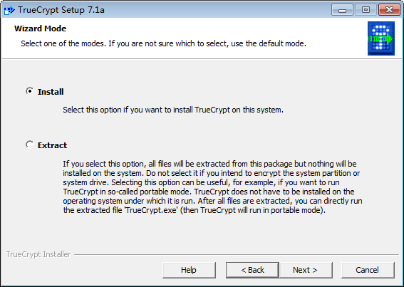

6.  单击“Install”。

    **图 4**  TrueCrypt工具安装路径<a name="fig1619616370511"></a>  
    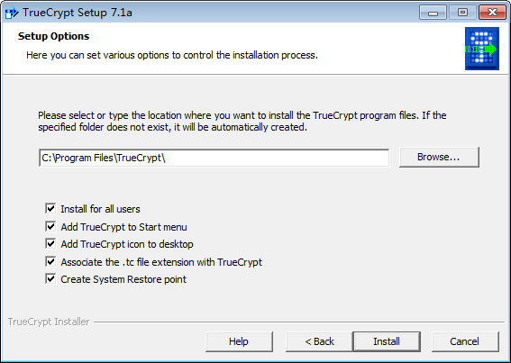

7.  出现“TrueCrypt has been successfully installed.”表示软件安装成功。

    **图 5**  成功安装TrueCrypt工具提示<a name="fig20620650852"></a>  
    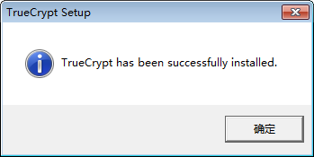

8.  单击“确定”。

    **图 6**  TrueCrypt工具安装成功<a name="fig929693413617"></a>  
    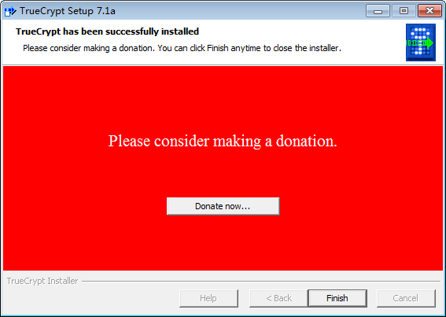

9.  单击“Finish”，完成TrueCrypt工具的安装。

## 在Windows操作系统下加密磁盘文件<a name="ades_user_guide_0028"></a>

介绍如何在Windows操作系统下加密磁盘文件。

## 操作步骤<a name="section11896134334510"></a>

1.  将需要邮寄的空磁盘挂载到计算机上。

    挂载完成后，打开“计算机”，根目录下会多一个空磁盘，此文档假设挂载的空磁盘名为“E”。

2.  双击“TrueCrypt”，打开“TrueCrypt”工具。

    **图 7**  打开TrueCrypt工具<a name="fig1085551312714"></a>  
    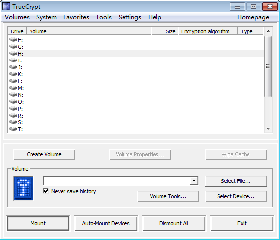

3.  单击“Create Volume”开始创建加密文件。

    **图 8**  “Create Volume”设置<a name="fig721412235819"></a>  
    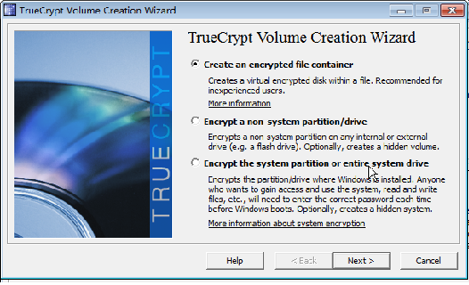

4.  单击“Next”。

    **图 9**  “Volume Type”设置<a name="fig742324019819"></a>  
    

5.  单击“Next”。

    **图 10**  “Volume Location”设置<a name="fig790712571986"></a>  
    

6.  单击“Select File”，选择挂载的空磁盘E，并在挂载的空磁盘中，新建一个加密文件。

    文件名需根据用户所创建的服务单号命名，后缀为iso。此处以文件名为“DES1469763303684.iso”为例。

    **图 11**  选择挂载磁盘<a name="fig1970629131011"></a>  
    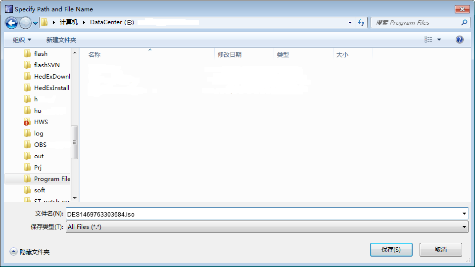

7.  单击“保存”。

    **图 12**  新建加密文件<a name="fig194852521010"></a>  
    

8.  单击“Next”，进入“Encryption Options”界面，在“Encryption Algorithm”框中选择“AES”。

    “Encryption Options”界面其他参数保持默认配置，不需要修改。

    **图 13**  “Encryption Options”参数配置<a name="fig109156519105"></a>  
    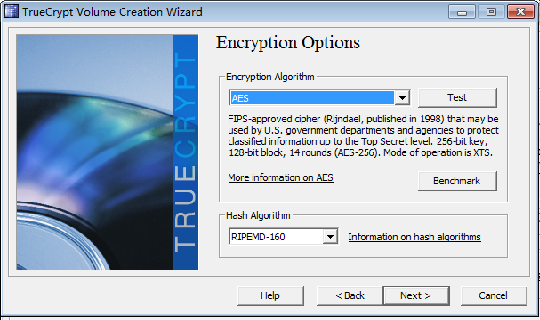

9.  单击“Next”，建议根据待邮寄的磁盘实际容量输入“Volume Size”到下图白框中，并选择正确的单位。

    若不根据磁盘实际大小值输入“Volume Size”，则输入的“Volume Size”值不可小于待邮寄磁盘中需要存储的数据的总字节数。

    **图 14**  “Volume Size”输入<a name="fig194451735121211"></a>  
    

10. 单击“Next”，按照提示输入密码。

    这里输入的密码表示为“DES1469763303684.iso”文件设置的加密密码，为保证数据安全，建议密码长度设置在20个字符以上。

    **图 15**  磁盘文件密码设置<a name="fig23233211314"></a>  
    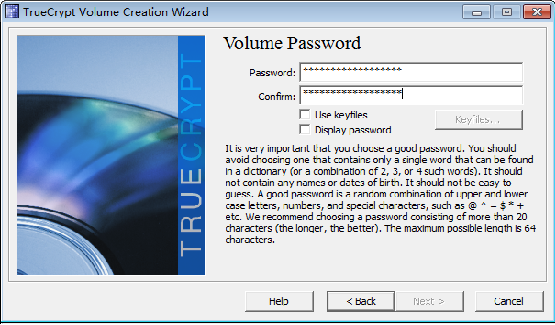

11. 单击“Next”。

    若需要加密的数据包含大文件（单个文件大小大于4GB），则选择“Yes”，若需要加密的数据不包含大文件，则选择“No”。

    **图 16**  加密大文件设置<a name="fig351525131415"></a>  
    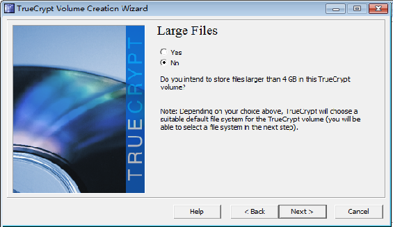

12. 单击“Next”。

    若需要加密的数据包含大文件（单个文件大小大于4GB），则“Filesystem”值选择“FAT”，否则“Filesystem”值选择“NTFS”。界面其他参数选择默认配置，不做修改。

    **图 17**  大文件“Filesystem”值设置<a name="fig577852219151"></a>  
    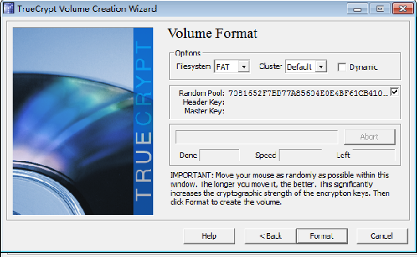

13. 单击“Format”，开始生成加密文件。

    **图 18**  成功加密文件提示<a name="fig139154131611"></a>  
    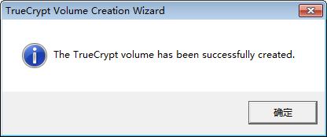

14. 单击“确定”。

    名为“DES1469763303684.iso”的加密文件生成成功。

    **图 19**  加密文件成功<a name="fig1813160111717"></a>  
    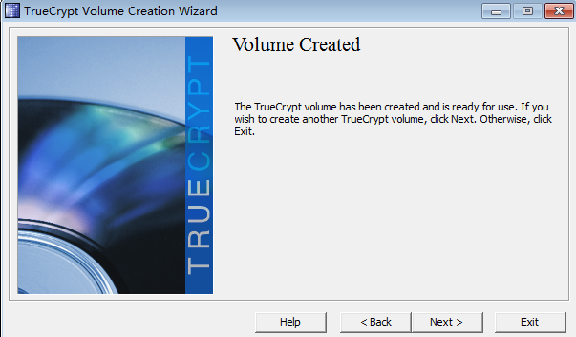

15. 单击“Exit”，返回到“TrueCrypt”工具主界面。

    **图 20**  加密成功后“TrueCrypt”工具主界面<a name="fig06526349176"></a>  
    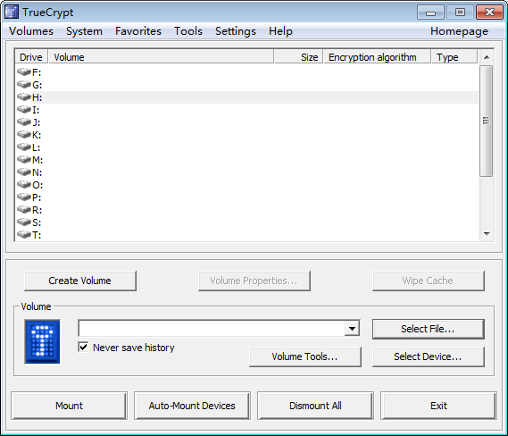

16. 单击“Select File”，选择以上步骤中生成的名为“DES1469763303684.iso”的加密文件，并在j界面上方选择一个虚拟磁盘（选择的虚拟磁盘不能与Windows系统中已有磁盘名称重复）。

    **图 21**  选择虚拟磁盘<a name="fig3165712121814"></a>  
    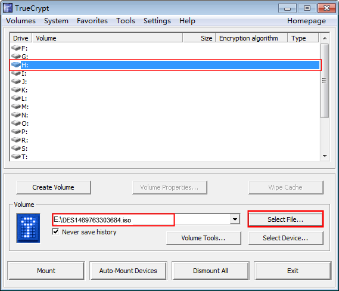

17. 单击“Mount”，并在弹出的对话框中输入“DES1469763303684.iso”文件的密码，将虚拟磁盘挂载到本地计算机（此处以H盘为例）。

    **图 22**  挂载虚拟磁盘到本地<a name="fig13816170121917"></a>  
    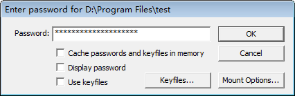

18. 单击“OK”，并打开本地“计算机”，在根目录下会多一个虚拟磁盘H。

    **图 23**  本地查看虚拟磁盘<a name="fig85214452017"></a>  
    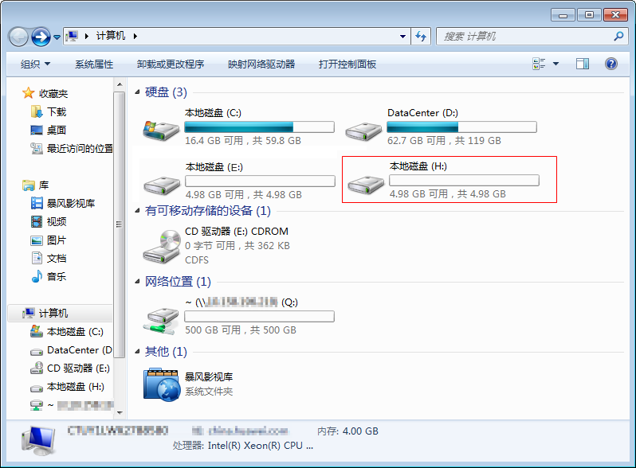

19. 将需要加密的数据拷贝到虚拟磁盘H中。
20. 拷贝完成后，打开“TrueCrypt”工具。

    选择虚拟磁盘H，并单击“Dismount”，卸载虚拟磁盘H。

    打开“计算机”，根目录下的磁盘H会消失。打开实际挂载在计算机上的磁盘，磁盘中只包含一个名为“DES1469763303684.iso”的加密文件。用户只需拔出该磁盘，并将该磁盘邮寄到数据中心即可。

    虚拟磁盘H卸载后，若还需要往磁盘中添加数据，则需要先打开“TrueCrypt”工具，将虚拟磁盘H挂载后，再将数据拷贝到虚拟磁盘中，数据拷贝完成后，需要卸载虚拟磁盘H，达到数据加密的目的。

    **图 24**  卸载虚拟磁盘<a name="fig099420298208"></a>  
    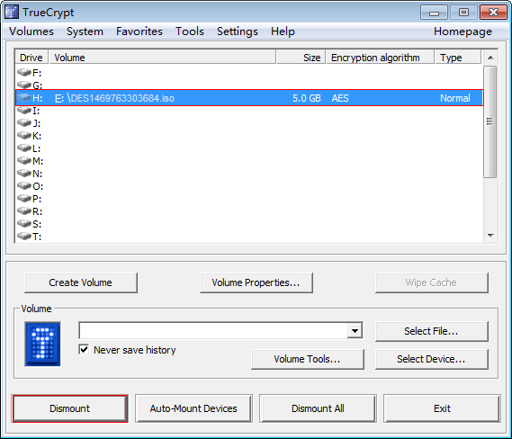


## 在Linux终端安装TrueCrypt工具<a name="ades_user_guide_0029"></a>

介绍如何在Linux操作系统下安装TrueCrypt工具。

## 操作步骤<a name="section2595359104814"></a>

1.  登录[华为云管理控制台](https://console.huaweicloud.com)。单击“服务列表 \> 数据快递服务”。
2.  进入DES管理控制台，如[图25](#fig16606944193710)，单击“下载加密工具”。

    **图 25**  下载加密工具（磁盘方式\>Linux-操作系统）<a name="fig16606944193710"></a>  
    

    > **说明：**   
    >也可以进入华为云[开发者中心](http://developer.huaweicloud.com/tools/des.html)，下载加密工具。  

3.  下载与Linux操作系统匹配的“TrueCrypt”工具版本。
4.  此文档以“TrueCrypt”工具软件包是“truecrypt-7.1a-linux-console-x64.tar.gz”为例。将“TrueCrypt”工具软件安装包“truecrypt-7.1a-linux-console-x64.tar.gz”拷贝到Linux终端的根目录下。
5.  登录Linux终端。
6.  执行以下命令解压“TrueCrypt”软件安装包。解压后，会生成名为“truecrypt-7.1a-setup-console-x64”的文件。

    ```
    tar -zxvf truecrypt-7.1a-linux-console-x64.tar.gz
    ```

7.  执行以下命令开始安装“TrueCrypt”工具。

    ```
    sh truecrypt-7.1a-setup-console-x64
    ```

8.  根据回显提示，在“To select,enter 1 or 2:”后输入“1”，按“Enter”。

    ```
    To select,enter 1 or 2: 1
    ```

9.  根据回显提示，按“Enter”开始阅读“TrueCrypt”工具协议。按向下箭头可翻页阅读。
10. 根据回显提示，在“Do you accept and agree to be bound by the license terms? \(yes/no\):”后输入“yes”，按“Enter”。

    ```
    Do you accept and agree to be bound by the license terms? (yes/no): yes
    ```

11. 根据回显提示，按“Enter”，完成“TrueCrypt”工具安装。

    ```
    Press Enter to exit
    ```

12. 执行以下命令，若出现图示内容，则表示“TrueCrypt”工具安装成功。

    ```
    truecrypt
    ```

    **图 26**  成功安装“TrueCrypt”工具代码提示<a name="fig1965961852916"></a>  
    


## 在Linux操作系统下加密磁盘文件<a name="ades_user_guide_0030"></a>

介绍如何在Linux操作系统下加密磁盘文件。

## 操作步骤<a name="section811341815371"></a>

1.  以root帐号登录Linux终端。
2.  将空磁盘挂载到Linux终端。执行命令**mount  /des/H**\(以“/des”为例，“/des”表示磁盘实际挂载路径，通过**fdisk -l**查看；“/H”表示共享路径，通过执行**mkdir  /H**命令在Linux服务器上创建\)
3.  进入挂载的空磁盘目录下，执行以下命令，开始创建加密文件。（假设“/H/”为挂载到Linux终端的空磁盘路径）

    ```
    truecrypt -c
    Volume type:
     1) Normal
     2) Hidden
    Select [1]: 1
    ```

4.  根据回显提示，在“Select \[1\]:”后输入“1”，按“Enter”。
5.  <a name="li1222113181374"></a>根据回显提示，在“Enter volume path:”后输入需要创建的加密文件的路径，按“Enter”。

    加密文件需创建在挂载的空磁盘的根目录下，且需要以已创建的服务单号命名，后缀为iso。例如，在“Enter volume path:”后输入“/H/DES1469763303684.iso”，表示创建的加密文件名为“DES1469763303684.iso”，该文件存放在“/H/”路径下。其中“/H/”为挂载到Linux终端的空磁盘路径。

6.  根据回显提示，在“Enter volume size \(sizeK/size\[M\]/sizeG\):”后输入需要创建的加密文件的大小，按“Enter”。

    建议用户输入的加密文件的大小与实际挂载的空磁盘容量保持一致，若不保持一致，则输入的加密文件的大小值不可小于待邮寄磁盘中需要存储的数据的总字节数。例如：挂载的空磁盘的容量为1TB，则在“Enter volume size \(sizeK/size\[M\]/sizeG\):”需要输入“1024G”。

7.  根据回显提示，在“Select \[1\]:”后选择“1”，表示使用AES编码算法对磁盘文件进行加密，按“Enter”。

    ```
    Enter volume size (sizeK/size[M]/sizeG): 1024G
    Encryption algorithm:
     1) AES
     2) Serpent
     3) Twofish
     4) AES-Twofish
     5) AES-Twofish-Serpent
     6) Serpent-AES
     7) Serpent-Twofish-AES
     8) Twofish-Serpent
    Select [1]: 1
    ```

8.  根据回显提示，在“Select \[1\]:”后选择散列算法，推荐选择“2”，表示使用SHA-512散列算法对磁盘文件进行加密，按“Enter”。

    ```
    Hash algorithm:
     1) RIPEMD-160
     2) SHA-512
     3) Whirlpool
    Select [2]: 4
    ```

9.  根据回显提示，在“Select \[2\]:”后选择磁盘文件系统格式，若需要加密的数据包含大文件（单个文件大小大于4GB），选择“2”，表示使用FAT磁盘文件系统格式对磁盘文件进行加密；否则选择“3”或“4”或“5”，表示使用其他相应的磁盘文件系统格式对磁盘文件进行加密，按“Enter”。

    ```
    Filesystem:
     1) None
     2) FAT
     3) Linux Ext2
     4) Linux Ext3
     5) Linux Ext4
    Select [2]: 4
    ```

10. 根据回显提示，依次在“Enter password:”后输入加密文件的密码，“Re-enter password:”后再次输入密码确认，按“Enter”。这里输入的密码表示为加密文件设置的加密密码，为保证数据安全，建议密码长度设置在20个字符以上。
11. 在回显信息“Enter keyfile path \[none\]:”后按“Enter”。
12. 根据回显提示，在“Please type at least 320 randomly chosen characters and then press Enter:”后任意输入不少于320字符的任意字符，按“Enter”。

    出现如下内容则表示加密文件创建成功。

    ```
    Please type at least 320 randomly chosen characters and then press Enter:
    Done: 100.000%  Speed: 281 MB/s  Left: 0 s
    The TrueCrypt volme has been successfully created.
    ```

13. 进入除挂载的空磁盘以外的其他有足够空间的磁盘路径下（该磁盘必须保证能存储下用户需要加密的所有数据），创建一个文件夹，用于挂载磁盘加密文件，存放加密数据。

    例如：进入合适的磁盘路径下，执行命令**mkdir /truecrypt**，创建名为“/truecrypt”的文件夹。“/truecrypt”的文件夹即为虚拟磁盘空间，用于挂载磁盘加密文件，存放加密数据。

14. 进入挂载的空磁盘目录下，执行以下命令，挂载加密文件到虚拟磁盘空间路径下。

    ```
    truecrypt -p "加密文件的密码" -k "" --protect-hidden=no 加密文件的路径虚拟磁盘空间名称
    ```

    > **说明：**   
    >此处的加密文件路径与[步骤5](#li1222113181374)中创建的加密文件路径保持一致。例如：“/H/DES1469763303684.iso”，表示加密文件名为“DES1469763303684.iso”，该文件存放在“/H/”路径下。其中“/H/”为挂载到Linux终端的空磁盘路径。  
    >例如：执行命令**truecrypt -p "xxxxxxxxxxxxxx" -k "" --protect-hidden=no /H/DES1469763303684.iso /truecrypt**表示将加密文件“DES1469763303684.iso”挂载到虚拟磁盘空间“/truecrypt”的路径下，且加密文件的密码为“xxxxxxxxxxxxxx”。  
    >磁盘文件挂载成功后，进入“/truecrypt”文件路进下，执行命令**ll**会查看到虚拟磁盘空间内会生成一个名为“lost+found”的文件（FAT文件系统格式的文件不会生产此文件）。  

15. 将需要加密的数据拷贝到新增的虚拟磁盘空间下。

    将需要加密的数据拷贝到虚拟磁盘空间后，进入“/truecrypt”文件路径下，执行命令**ll**会查看到虚拟磁盘空间内会包含拷贝成功的数据。

16. 进入挂载的空磁盘磁盘根目录下，执行以下命令卸载虚拟磁盘。

    ```
    truecrypt -d 虚拟磁盘路径
    ```

    > **说明：**   
    >此处的加密文件路径与[步骤5](#li1222113181374)中创建的加密文件路径保持一致。例如：“/H/DES1469763303684.iso”，表示加密文件名为“DES1469763303684.iso”，该文件存放在“/H/”路径下。其中“/H/”为挂载到Linux终端的空磁盘路径。  
    >虚拟磁盘卸载成功后，进入“/truecrypt”文件路进下，执行命令**ll**会查看到虚拟磁盘空间又变为空，表示虚拟磁盘空间已卸载。  
    >虚拟磁盘卸载后，若还需要往磁盘中添加数据，则需要先进入挂载的空磁盘目录下，执行命令**truecrypt -p "加密文件的密码" -k "" --protect-hidden=no 加密文件的路径虚拟磁盘空间名称**，将虚拟磁盘挂载后，再将数据拷贝到虚拟磁盘中，数据拷贝完成后，需要执行**truecrypt -d  **虚拟磁盘路径****命令卸载虚拟磁盘，达到数据加密的目的。  


