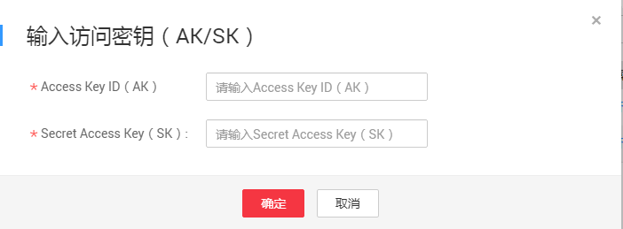

# 启动数据上传

数据中心管理员接收用户磁盘，并将磁盘挂载到服务器后，会短信通知用户输入访问密钥（AK/SK），访问密钥（AK/SK）验证成功后启动数据上传。

## 前提条件

用户收到输入访问密钥（AK/SK）短信通知。

## 操作步骤

1.  登录DES管理控制台。
2.  选择服务单列表中“待输入访问密钥（AK/SK）”状态服务单，在操作列单击“输入访问密钥（AK/SK）”。
3.  根据界面提示，将后台上传数据到OBS桶中需要的访问密钥（AK/SK），输入到弹出的对话框中。如[图1](#fig1275016339452)。

    **图 1**  输入访问密钥（磁盘方式）  
    

    -   Access Key ID（AK）：后台往OBS桶中上传数据时需要使用的接入证书，一个AK对应唯一用户。
    -   Secret Access Key（SK）：后台往OBS桶中上传数据时需要使用的安全证书，SK与AK一一对应，形成访问OBS时的密钥对，确保访问安全。

    -   IDPMCPS-NOTE-MARK-START
 **说明：** 

若没有访问密钥（AK/SK），请通过单击右上角用户名，并在下拉列表中单击“[我的凭证](https://console.huaweicloud.com/iam/#/myCredential)”，进入“我的凭证”界面，单击“管理访问密钥”页签下方的“新增访问密钥”，创建密钥。

4.  单击“确定”，提交AK/SK。AK/SK提交成功，且后台验证AK/SK无误后，数据便开始上传。

